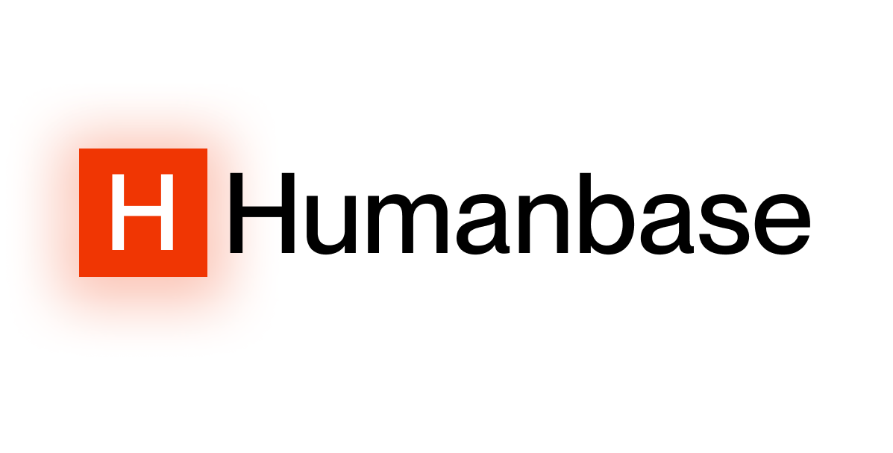
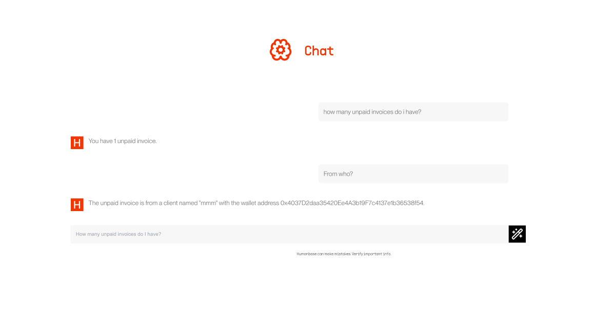

# Humanbase

Humanbase gives your financial data superpowers. You can now ask questions about your invoices, statements and get answers in seconds.

[Demo Video](https://youtu.be/MMEv7rX0bsE)



## Features


Chat with your invoices, statements and get answers in seconds.



---


## Getting Started

To get started, clone the repository and run the development server:

## Tech Stack

- Next.js
- TailwindCSS
- Request Network
- Vercel AI

```bash
npm run dev
```

This will start the development server and open the application in your browser.

## Learn More

To learn more about Humanbase, take a look at the following resources:

- [Humanbase](https://humanbase.xyz)
- [Humanbase GitHub Repository](https://github.com/kohasummons/humanbase)
